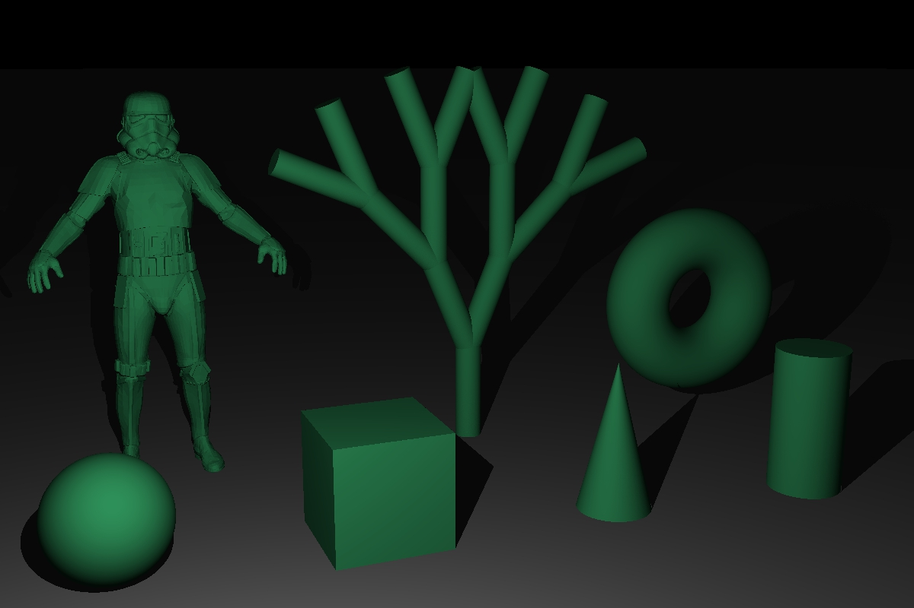

<h1 align="center"> 3D Modeling and Rendering Software </h1>

  

> A C++/OpenFrameworks modeling and rendering application that supports both Ray Tracing and Ray Marching. Started as a simple ray tracer and was later extended to include various rendering and modeling features.
> The goal of this project was to improve upon a simple ray tracer and learn about various concepts in computer graphics.

# Table of Contents
* [Features](#features)
* [Setup and Usage](#setup-and-usage)
* [Screenshots](#screenshots)
* [Mesh Texture Mapping](#mesh-texture-mapping)
* [Room for Improvement](#room-for-improvement)

# Features
- Rendering
  - Ray Tracing / Ray Marching rendering algorithms
  - Ray-intersection and SDFs(signed distance functions) for the following primitives:
    - Sphere 
    - Cube
    - Plane (infinite for Ray Marching)
    - Cylinder
    - Cone
    - Torus
    - Triangle Mesh (.obj only)
    - LSystem
  - Multithreading
  - Bounding boxes
  - BVH (Bounding volume hierarchy)
  - MSAA (MultiSampling Anti-Aliasing)
- Shading
  - Point Light
  - Spot Light
  - Area Light/Soft Shadows
  - Smooth Shading / Normal interpolation (for Ray Tracing only)
  - Lambert Shading
  - Blinn-Phong Shading
  - Fresnel with reflection/refraction
  - Materials:
    - Matte
    - Mirror
    - Glass
    - Reflective
  - Texture Mapping (for Ray Tracing only)
- User Interface
  - Interactive scene using OpenFrameworks camera
  - Rendering camera translation/rotation
  - Grid Toggle
  - Object creation/deletion
  - Object transformations (Translate, Rotate, Scale)
  - Save Rendered Image (formats supported: .png, .jpg)
  - Command Console for displaying rendering progress
  - Keyboard shortcuts

# Setup and Usage
The application can be found [here](https://drive.google.com/drive/folders/1YKLREWbP2Svwp_XneyNIbeFHw3LQJkYR?usp=sharing).
Download the zip file, unzip it, and then click on the .exe file to run the application. 

A few tips for using the application:
- Shortcuts are displayed right next to its corresponding UI component.
- Double left click on the 3D scene to reset view.
- Double right click on UI sliders(i.e. object's position, rotation, scale, color or key values like radius) will allow the user to input a specific value.
- You can disable/enable the scene grid or acceleration structure(BVH).
- You can click on the rendering camera, then select the toggle button 'Render Camera View' and finally change position or rotation to both change the point of view of the camera and monitor how the rendered image will look like.
- When saving the rendered image, include the .png or .jpg extension to the end of the file name.

# Screenshots
<h3> Scene and UI examples (3D environment) </h3>

<h3> Rendered Images </h3> 

<h3> Ray Marching vs Ray Tracing </h3> 

<h4> Ray Marching Example (1 sample)</h4>

<h4> Ray Tracing Example (16 samples)</h4> 

# Mesh Texture Mapping
This section is in regards to triangle mesh texture mapping.
If the mesh has no .mtl file or texture image, it will be rendered with the object's color. 

In order to texture the mesh, all of the following must be satisfied:
- The .mtl and .obj files need to be in the same directory.
- Under the .mtl file, the 'map_Kd' line must have just the texture file name(the name should contain no spaces) not the whole directory path(ex. map_Kd checkboard.png).
- The texture image files(.png, .jpg, .tga) found in the .mtl file need to be in the same directory as the .mtl and .obj files.

